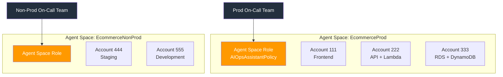
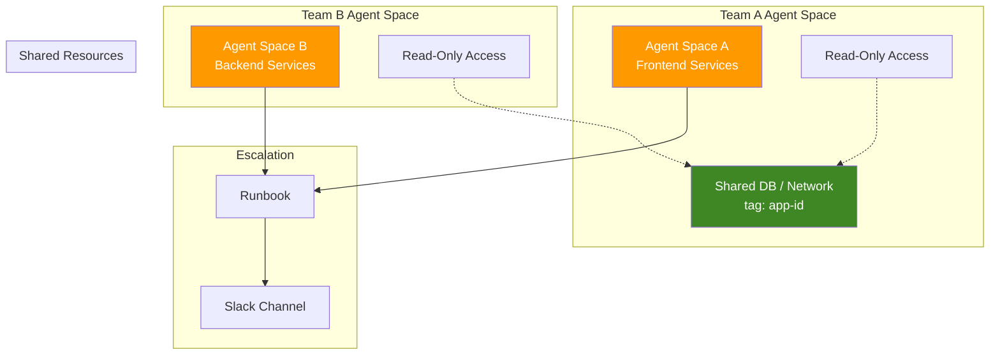
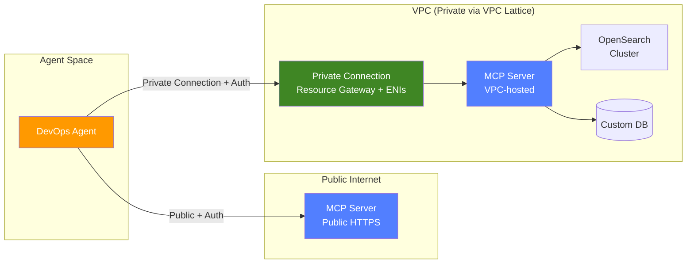
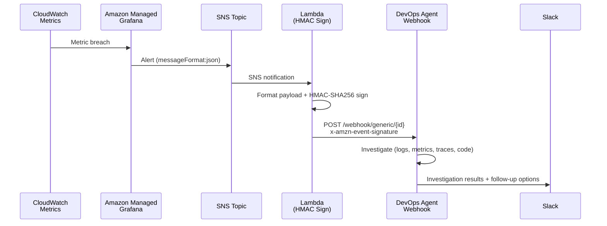
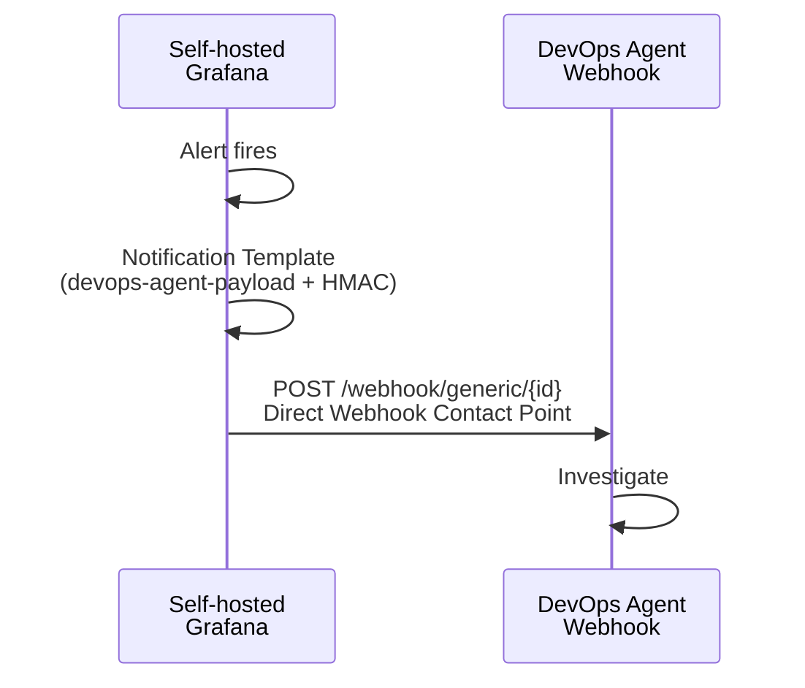
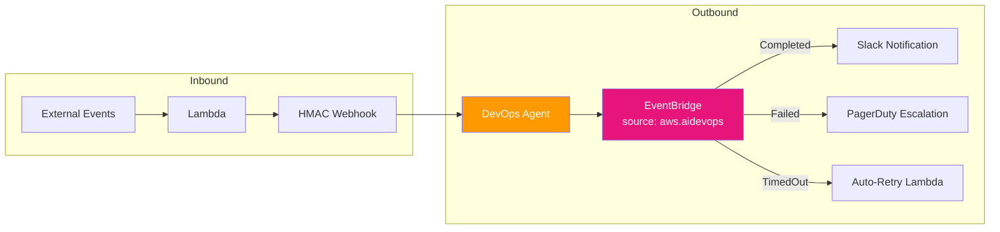
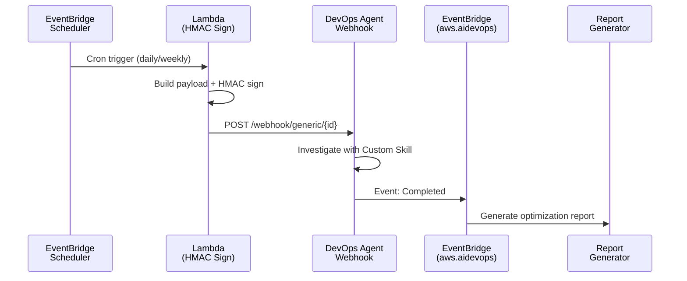

# AWS DevOps Agent — Best Practices & Integration Patterns

A curated collection of best practices, integration patterns, and hands-on labs for deploying [AWS DevOps Agent](https://aws.amazon.com/devops-agent/) in production environments.

## 📖 Documentation

- [English](README.md)
- [繁體中文](README.zh-TW.md)
- [简体中文](README.zh-CN.md)

## 🏗️ Agent Space Design

### Core Principle: Agent Space = On-Call Boundary

Design your Agent Space boundaries the same way you design on-call responsibilities:

| Guideline | Recommendation |
|-----------|---------------|
| One on-call team | One Agent Space |
| Prod vs Non-Prod | Separate Agent Spaces |
| Tightly coupled microservices (same resolver group) | Single Agent Space |
| Cross-account monolith | One Agent Space + cross-account access |



### Common Patterns

1. **Cross-Team Investigations** — Each team owns its Agent Space + read-only access to shared resource accounts + consistent tagging (`app-id`) + runbook escalation
2. **Shared Services / NOC** — Dedicated Agent Space scoped to shared infrastructure (DB, networking, monitoring)
3. **Enterprise Scale (100+ apps)** — IaC templates (CDK/Terraform) + CI/CD auto-deploy Agent Spaces per application team



## 🔐 IAM & Security

- **Two distinct IAM roles required:**
  - **Agent Space role** — `AIOpsAssistantPolicy` + AWS Support + expanded capabilities (for agent investigation)
  - **Operator app role** — Controls human access in web app (start/view investigations, create support cases)
- **SCP Checklist:** Ensure SCPs do NOT block `aidevops:*` or `bedrock:InvokeModel`. Bedrock inference may use US regions beyond us-east-1.
- **Webhook secrets** — Store in AWS Secrets Manager, rotate per security policy

## 🔗 Integration Priority

| Priority | Integration | Configuration |
|----------|------------|---------------|
| 1 | Amazon CloudWatch | Automatic via IAM roles |
| 2 | APM (Datadog / Dynatrace / New Relic / Splunk) | API key or OAuth per Agent Space |
| 3 | Code Repositories (GitHub / GitLab) | OAuth or PAT |
| 4 | CI/CD Pipelines | Configured with code repo integration |
| 5 | Communication (Slack / ServiceNow) | Real-time investigation updates |

### Third-Party OAuth Tools (GitHub, Dynatrace)

Two-step process:
1. **Account-level registration** — Establish OAuth credentials (shared across Agent Spaces)
2. **Agent Space-level association** — Select specific resources per Agent Space

### MCP Server Integration

| Requirement | Detail |
|-------------|--------|
| Transport | **Streamable HTTP** transport protocol |
| Endpoint | Public HTTPS or **Private Connection** (VPC-hosted supported) |
| Tools | **Read-only only** (write operations = prompt injection risk) |
| Allowlisting | Account-level register → Agent Space-level enable |
| Tool name | Max 64 characters |
| Auth | OAuth Client Credentials / OAuth 3LO / API Key / **AWS SigV4** |
| URL format | Full path: `https://mcp.example.com/v1/mcp` |

> 💡 **Private Connection ≠ no auth.** Private Connection (via VPC Lattice) solves network reachability only. Authentication (OAuth/API Key/SigV4) is still required independently. If using OAuth with Private Connection, the token exchange endpoint must also be routable through the same connection.



## 🚀 Trigger Methods

AWS DevOps Agent has **3 trigger methods**:

1. **Built-in integrations** — ServiceNow, PagerDuty
2. **Webhooks** — HMAC Generic (external monitoring → Agent)
3. **Manual** — Web App console

> ⚠️ CW Alarm Action → Investigation Group ARN triggers **CloudWatch Investigations** (different product), NOT DevOps Agent.

### Webhook Specification

```
URL:     https://event-ai.{region}.api.aws/webhook/generic/{ID}
Auth:    HMAC-SHA256 = base64(HMAC(secret, '{timestamp}:{payload}'))
Headers: x-amzn-event-timestamp, x-amzn-event-signature
```

**Payload fields:** `eventType`, `incidentId` (dedup key), `action`, `priority`, `title`, `description`, `service`, `timestamp`, `data.metadata`

### Reactive Pattern — AMG Alert → DevOps Agent



### Self-hosted Grafana — Direct Webhook (Zero Lambda)



### Deduplication Behavior

- Agent deduplicates by `incidentId` — same ID links to existing investigation
- **Production:** Use fingerprint-based ID (correct dedup)
- **Demo/Testing:** Append timestamp to force new investigation each time

## 📊 EventBridge Bidirectional Integration

- **Inbound:** External events → Lambda → HMAC Webhook → Trigger investigation
- **Outbound:** Source `aws.aidevops` → Events: `Completed` / `Failed` / `TimedOut` → Downstream actions



### Proactive Pattern — Scheduled Investigation



## 🧪 Hands-On Labs & Examples

| Repository | Description |
|-----------|-------------|
| [devops-agent-webhook-lab](https://github.com/zhwenhao-amzn/devops-agent-webhook-lab) | End-to-end webhook integration patterns: AMG Alert → SNS → Lambda → DevOps Agent, proactive scheduled investigations, and MCP Tool for AI agent invocation |
| [mcp-server-demo](https://github.com/zhwenhao-amzn/mcp-server-demo) | MCP server implementation demo for extending DevOps Agent with custom data sources |
| [opensearch-mcp-server-for-devops-agent](https://github.com/zhwenhao-amzn/opensearch-mcp-server-for-devops-agent) | OpenSearch MCP server enabling DevOps Agent to query VPC-hosted OpenSearch clusters via API Gateway + Cognito OAuth 2.1 |
| [grafana-integration](grafana-integration/) | Built-in Grafana integration setup (50+ tools), AMG token rotation automation (EventBridge + Lambda), and guidance on when to use custom Grafana MCP server |

## 📚 Official Resources

- [AWS DevOps Agent Documentation](https://docs.aws.amazon.com/devopsagent/latest/userguide/)
- [Best Practices Blog Post](https://aws.amazon.com/blogs/devops/best-practices-for-deploying-aws-devops-agent-in-production/)
- [CDK Sample](https://github.com/aws-samples/sample-aws-devops-agent-cdk)
- [Terraform Sample](https://github.com/aws-samples/sample-aws-devops-agent-terraform)
- [Webhook Integration Guide](https://docs.aws.amazon.com/devopsagent/latest/userguide/configuring-capabilities-for-aws-devops-agent-invoking-devops-agent-through-webhook.html)
- [MCP Server Connection Guide](https://docs.aws.amazon.com/devopsagent/latest/userguide/configuring-capabilities-for-aws-devops-agent-connecting-mcp-servers.html)

## 🏷️ Native Integration Ecosystem

| Category | Supported |
|----------|-----------|
| Telemetry | CloudWatch, Datadog, Dynatrace, New Relic, Splunk, Grafana |
| Ticketing | ServiceNow, PagerDuty, Slack |
| Code | GitHub, GitLab, Azure DevOps |
| Cloud | AWS native, Azure |
| Auth | Bearer Token, HMAC, OAuth 2.0 |

## 💡 Tips from Field Experience

- DevOps Agent provides **follow-up options** at end of responses — use them to dig deeper
- **EKS integration:** `create-access-entry` + `AmazonAIOpsAssistantPolicy` (read-only kubectl), cluster needs `AuthenticationMode=API_AND_CONFIG_MAP`
- **Proactive pattern:** EventBridge Scheduler → Lambda → HMAC Webhook → Agent with Custom Skill → EventBridge completion → Report (~$50/month)
- **AMG limitation:** No Webhook Contact Point support. Use AMG → SNS → Lambda → HMAC Webhook path
- **Self-hosted Grafana:** Can directly use Webhook Contact Point (zero Lambda/APIGW)

## License

This project is licensed under the MIT License.
