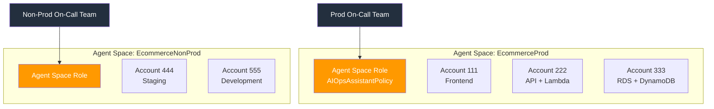
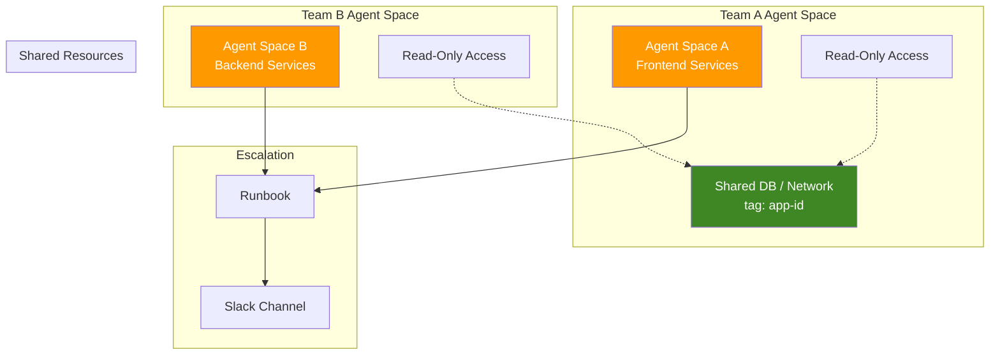
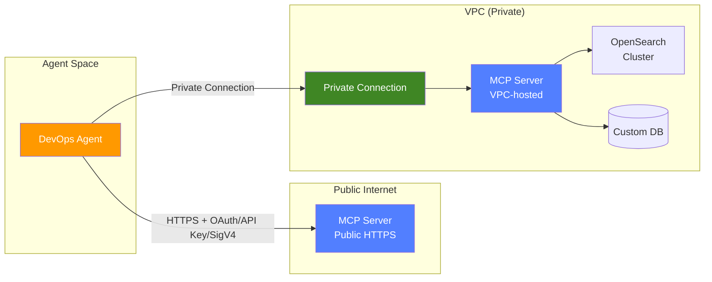
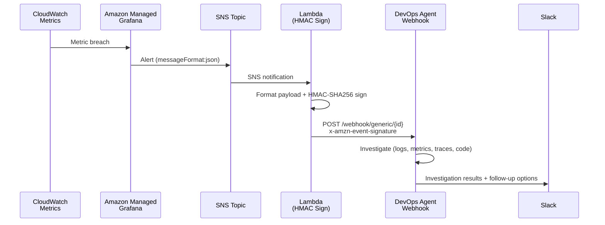
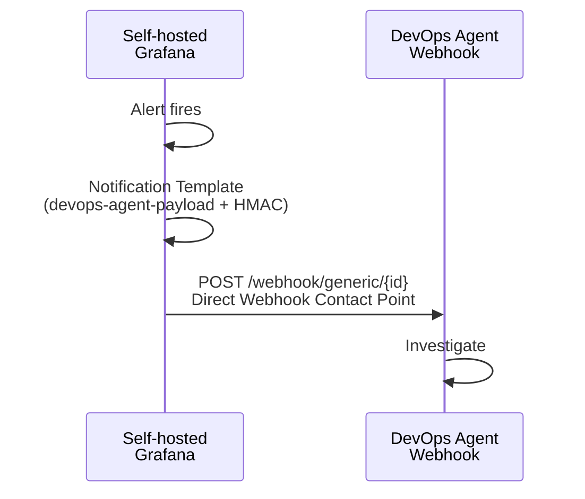
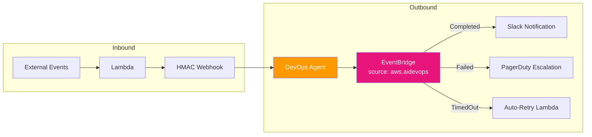
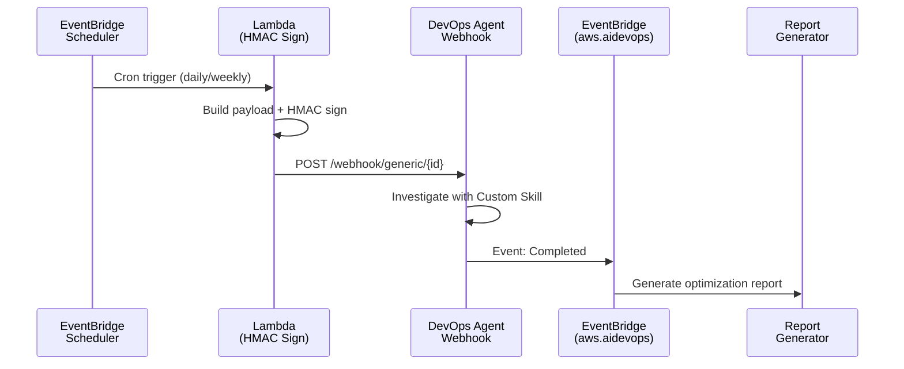

# AWS DevOps Agent — 最佳实践与集成模式

精选的最佳实践、集成模式与实操 Lab，帮助您在生产环境中部署 [AWS DevOps Agent](https://aws.amazon.com/devops-agent/)。

## 📖 文档

- [English](README.md)
- [繁體中文](README.zh-TW.md)
- [简体中文](README.zh-CN.md)

## 🏗️ Agent Space 设计

### 核心原则：Agent Space = On-Call 边界

以 on-call 职责的方式设计 Agent Space 边界：

| 准则 | 建议 |
|------|------|
| 一个 on-call team | 一个 Agent Space |
| Prod vs Non-Prod | 分开的 Agent Space |
| 紧耦合微服务（同一 resolver group） | 单一 Agent Space |
| 跨账号 monolith | 一个 Agent Space + cross-account access |



### 常见模式

1. **跨团队调查** — 各团队拥有自己的 Agent Space + shared resource account 的 read-only access + 一致的 tagging（`app-id`）+ runbook escalation
2. **Shared Services / NOC** — 专属 Agent Space，范围限定在共享基础设施（DB、网络、监控）
3. **企业规模（100+ 应用）** — IaC 模板（CDK/Terraform）+ CI/CD 自动部署每个应用团队的 Agent Space



## 🔐 IAM 与安全性

- **需要两组不同的 IAM role：**
  - **Agent Space role** — `AIOpsAssistantPolicy` + AWS Support + 扩展权限（供 agent 调查使用）
  - **Operator app role** — 控制人员在 web app 的操作（启动/查看调查、创建 support case）
- **SCP 检查清单：** 确认 SCP 没有 block `aidevops:*` 或 `bedrock:InvokeModel`。Bedrock inference 可能使用 us-east-1 以外的 US regions。
- **Webhook secret** — 存放在 AWS Secrets Manager，按安全策略定期 rotate

## 🔗 集成优先顺序

| 优先级 | 集成 | 配置方式 |
|--------|------|---------|
| 1 | Amazon CloudWatch | 通过 IAM role 自动启用 |
| 2 | APM（Datadog / Dynatrace / New Relic / Splunk） | API key 或 OAuth per Agent Space |
| 3 | 代码仓库（GitHub / GitLab） | OAuth 或 PAT |
| 4 | CI/CD Pipelines | 随代码仓库一起配置 |
| 5 | 通信（Slack / ServiceNow） | 实时调查更新 |

### 第三方 OAuth 工具（GitHub、Dynatrace）

两步流程：
1. **Account-level 注册** — 建立 OAuth credentials（跨 Agent Space 共用）
2. **Agent Space-level 关联** — 选择每个 Agent Space 要使用的特定资源

### MCP Server 集成

| 要求 | 说明 |
|------|------|
| Transport | **Streamable HTTP** transport protocol |
| Endpoint | Public HTTPS 或 **Private Connection**（VPC-hosted 支持） |
| Tools | **仅限 read-only**（write operations = prompt injection 风险） |
| Allowlisting | Account-level 注册 → Agent Space-level 启用 |
| Tool name | 最长 64 字符 |
| Auth | OAuth Client Credentials / OAuth 3LO / API Key / **AWS SigV4** |
| URL 格式 | 完整路径：`https://mcp.example.com/v1/mcp` |



## 🚀 触发方式

AWS DevOps Agent 有 **3 种触发方式**：

1. **Built-in integrations** — ServiceNow、PagerDuty
2. **Webhooks** — HMAC Generic（外部监控 → Agent）
3. **Manual** — Web App 控制台

> ⚠️ CW Alarm Action → Investigation Group ARN 触发的是 **CloudWatch Investigations**（不同产品），不是 DevOps Agent。

### Webhook 规格

```
URL:     https://event-ai.{region}.api.aws/webhook/generic/{ID}
Auth:    HMAC-SHA256 = base64(HMAC(secret, '{timestamp}:{payload}'))
Headers: x-amzn-event-timestamp, x-amzn-event-signature
```

**Payload 字段：** `eventType`、`incidentId`（dedup key）、`action`、`priority`、`title`、`description`、`service`、`timestamp`、`data.metadata`

### Reactive 模式 — AMG Alert → DevOps Agent



### Self-hosted Grafana — 直接 Webhook（零 Lambda）



### 去重行为

- Agent 以 `incidentId` 做去重 — 相同 ID 会链接到已有调查
- **生产环境：** 使用 fingerprint-based ID（正确去重）
- **Demo/测试：** 加上 timestamp 强制每次触发新调查

## 📊 EventBridge 双向集成

- **Inbound：** 外部事件 → Lambda → HMAC Webhook → 触发调查
- **Outbound：** Source `aws.aidevops` → 事件：`Completed` / `Failed` / `TimedOut` → 下游动作



### Proactive 模式 — 定时调查



## 🧪 实操 Lab 与示例

| 仓库 | 说明 |
|------|------|
| [devops-agent-webhook-lab](https://github.com/zhwenhao-amzn/devops-agent-webhook-lab) | 端到端 webhook 集成模式：AMG Alert → SNS → Lambda → DevOps Agent、定时主动调查、AI agent 调用用 MCP Tool |
| [mcp-server-demo](https://github.com/zhwenhao-amzn/mcp-server-demo) | MCP server 实现 demo，扩展 DevOps Agent 自定义数据源 |
| [opensearch-mcp-server-for-devops-agent](https://github.com/zhwenhao-amzn/opensearch-mcp-server-for-devops-agent) | OpenSearch MCP server，通过 API Gateway + Cognito OAuth 2.1 让 DevOps Agent 查询 VPC-hosted OpenSearch 集群 |

## 📚 官方资源

- [AWS DevOps Agent 文档](https://docs.aws.amazon.com/devopsagent/latest/userguide/)
- [最佳实践 Blog](https://aws.amazon.com/blogs/devops/best-practices-for-deploying-aws-devops-agent-in-production/)
- [CDK 示例](https://github.com/aws-samples/sample-aws-devops-agent-cdk)
- [Terraform 示例](https://github.com/aws-samples/sample-aws-devops-agent-terraform)
- [Webhook 集成指南](https://docs.aws.amazon.com/devopsagent/latest/userguide/configuring-capabilities-for-aws-devops-agent-invoking-devops-agent-through-webhook.html)
- [MCP Server 连接指南](https://docs.aws.amazon.com/devopsagent/latest/userguide/configuring-capabilities-for-aws-devops-agent-connecting-mcp-servers.html)

## 🏷️ 原生集成生态

| 类别 | 支持 |
|------|------|
| 遥测 | CloudWatch、Datadog、Dynatrace、New Relic、Splunk、Grafana |
| 工单 | ServiceNow、PagerDuty、Slack |
| 代码 | GitHub、GitLab、Azure DevOps |
| 云 | AWS native、Azure |
| 认证 | Bearer Token、HMAC、OAuth 2.0 |

## 💡 实战经验 Tips

- DevOps Agent 在响应结尾提供 **follow-up options** — 善用可深入排查
- **EKS 集成：** `create-access-entry` + `AmazonAIOpsAssistantPolicy`（read-only kubectl），集群需 `AuthenticationMode=API_AND_CONFIG_MAP`
- **主动模式：** EventBridge Scheduler → Lambda → HMAC Webhook → Agent with Custom Skill → EventBridge completion → Report（约 $50/月）
- **AMG 限制：** 不支持 Webhook Contact Point。需走 AMG → SNS → Lambda → HMAC Webhook 路径
- **Self-hosted Grafana：** 可直接使用 Webhook Contact Point（零 Lambda/APIGW）

## License

This project is licensed under the MIT License.
