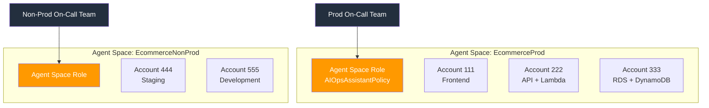
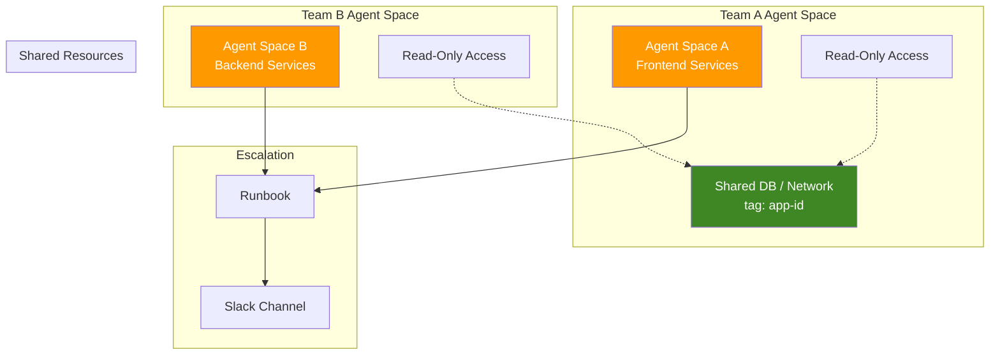
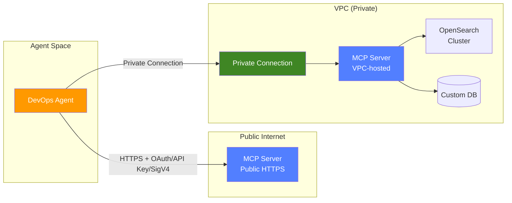
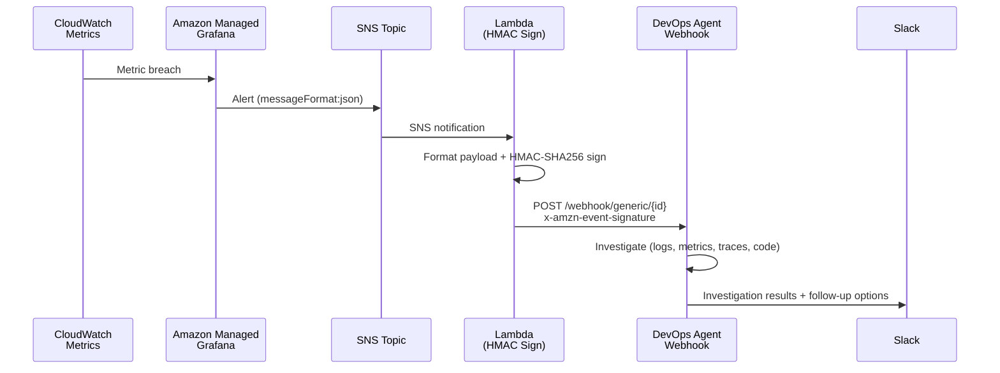
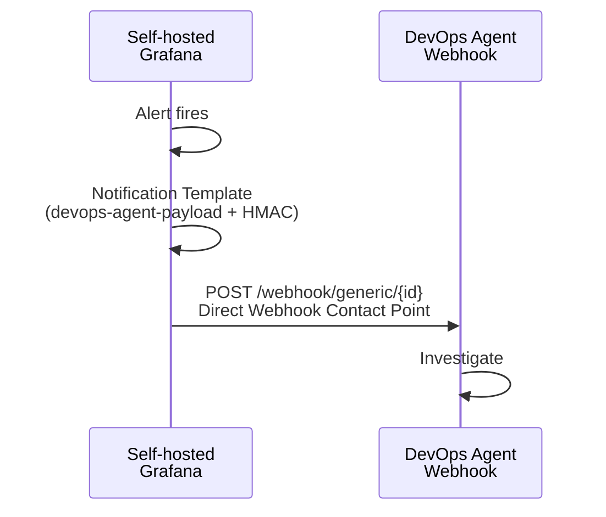
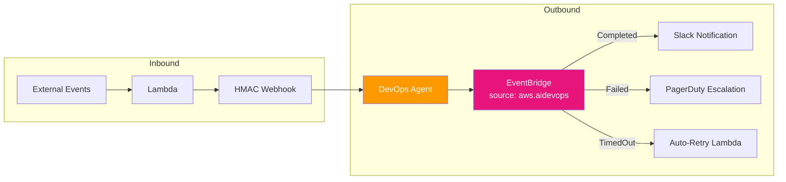
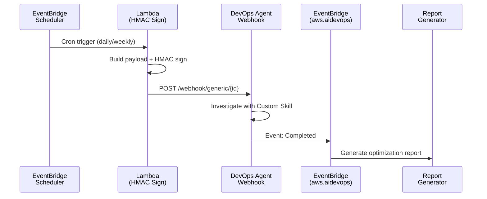

# AWS DevOps Agent — 最佳實踐與整合模式

精選的最佳實踐、整合模式與實作 Lab，協助您在生產環境中部署 [AWS DevOps Agent](https://aws.amazon.com/devops-agent/)。

## 📖 文件

- [English](README.md)
- [繁體中文](README.zh-TW.md)
- [简体中文](README.zh-CN.md)

## 🏗️ Agent Space 設計

### 核心原則：Agent Space = On-Call 邊界

以 on-call 職責的方式設計 Agent Space 邊界：

| 準則 | 建議 |
|------|------|
| 一個 on-call team | 一個 Agent Space |
| Prod vs Non-Prod | 分開的 Agent Space |
| 緊耦合微服務（同一 resolver group） | 單一 Agent Space |
| 跨帳號 monolith | 一個 Agent Space + cross-account access |



### 常見模式

1. **跨團隊調查** — 各團隊擁有自己的 Agent Space + shared resource account 的 read-only access + 一致的 tagging（`app-id`）+ runbook escalation
2. **Shared Services / NOC** — 專屬 Agent Space，範圍限定在共享基礎設施（DB、網路、監控）
3. **企業規模（100+ 應用）** — IaC 模板（CDK/Terraform）+ CI/CD 自動部署每個應用團隊的 Agent Space



## 🔐 IAM 與安全性

- **需要兩組不同的 IAM role：**
  - **Agent Space role** — `AIOpsAssistantPolicy` + AWS Support + 擴展權限（供 agent 調查使用）
  - **Operator app role** — 控制人員在 web app 的操作（啟動/查看調查、建立 support case）
- **SCP 檢查清單：** 確認 SCP 沒有 block `aidevops:*` 或 `bedrock:InvokeModel`。Bedrock inference 可能使用 us-east-1 以外的 US regions。
- **Webhook secret** — 存放在 AWS Secrets Manager，依安全政策定期 rotate

## 🔗 整合優先順序

| 優先順序 | 整合 | 設定方式 |
|---------|------|---------|
| 1 | Amazon CloudWatch | 透過 IAM role 自動啟用 |
| 2 | APM（Datadog / Dynatrace / New Relic / Splunk） | API key 或 OAuth per Agent Space |
| 3 | 程式碼儲存庫（GitHub / GitLab） | OAuth 或 PAT |
| 4 | CI/CD Pipelines | 隨程式碼儲存庫一起設定 |
| 5 | 通訊（Slack / ServiceNow） | 即時調查更新 |

### 第三方 OAuth 工具（GitHub、Dynatrace）

兩步驟流程：
1. **Account-level 註冊** — 建立 OAuth credentials（跨 Agent Space 共用）
2. **Agent Space-level 關聯** — 選擇每個 Agent Space 要使用的特定資源

### MCP Server 整合

| 需求 | 說明 |
|------|------|
| Transport | **Streamable HTTP** transport protocol |
| Endpoint | Public HTTPS 或 **Private Connection**（VPC-hosted 支援） |
| Tools | **僅限 read-only**（write operations = prompt injection 風險） |
| Allowlisting | Account-level 註冊 → Agent Space-level 啟用 |
| Tool name | 最長 64 字元 |
| Auth | OAuth Client Credentials / OAuth 3LO / API Key / **AWS SigV4** |
| URL 格式 | 完整路徑：`https://mcp.example.com/v1/mcp` |



## 🚀 觸發方式

AWS DevOps Agent 有 **3 種觸發方式**：

1. **Built-in integrations** — ServiceNow、PagerDuty
2. **Webhooks** — HMAC Generic（外部監控 → Agent）
3. **Manual** — Web App 主控台

> ⚠️ CW Alarm Action → Investigation Group ARN 觸發的是 **CloudWatch Investigations**（不同產品），不是 DevOps Agent。

### Webhook 規格

```
URL:     https://event-ai.{region}.api.aws/webhook/generic/{ID}
Auth:    HMAC-SHA256 = base64(HMAC(secret, '{timestamp}:{payload}'))
Headers: x-amzn-event-timestamp, x-amzn-event-signature
```

**Payload 欄位：** `eventType`、`incidentId`（dedup key）、`action`、`priority`、`title`、`description`、`service`、`timestamp`、`data.metadata`

### Reactive 模式 — AMG Alert → DevOps Agent



### Self-hosted Grafana — 直接 Webhook（零 Lambda）



### 去重複行為

- Agent 以 `incidentId` 做去重複 — 相同 ID 會連結到既有調查
- **生產環境：** 使用 fingerprint-based ID（正確去重複）
- **Demo/測試：** 加上 timestamp 強制每次觸發新調查

## 📊 EventBridge 雙向整合

- **Inbound：** 外部事件 → Lambda → HMAC Webhook → 觸發調查
- **Outbound：** Source `aws.aidevops` → 事件：`Completed` / `Failed` / `TimedOut` → 下游動作



### Proactive 模式 — 排程調查



## 🧪 實作 Lab 與範例

| 儲存庫 | 說明 |
|--------|------|
| [devops-agent-webhook-lab](https://github.com/zhwenhao-amzn/devops-agent-webhook-lab) | 端到端 webhook 整合模式：AMG Alert → SNS → Lambda → DevOps Agent、排程式主動調查、AI agent 呼叫用 MCP Tool |
| [mcp-server-demo](https://github.com/zhwenhao-amzn/mcp-server-demo) | MCP server 實作 demo，擴展 DevOps Agent 自訂資料來源 |
| [opensearch-mcp-server-for-devops-agent](https://github.com/zhwenhao-amzn/opensearch-mcp-server-for-devops-agent) | OpenSearch MCP server，透過 API Gateway + Cognito OAuth 2.1 讓 DevOps Agent 查詢 VPC-hosted OpenSearch 叢集 |

## 📚 官方資源

- [AWS DevOps Agent 文件](https://docs.aws.amazon.com/devopsagent/latest/userguide/)
- [最佳實踐 Blog](https://aws.amazon.com/blogs/devops/best-practices-for-deploying-aws-devops-agent-in-production/)
- [CDK 範例](https://github.com/aws-samples/sample-aws-devops-agent-cdk)
- [Terraform 範例](https://github.com/aws-samples/sample-aws-devops-agent-terraform)
- [Webhook 整合指南](https://docs.aws.amazon.com/devopsagent/latest/userguide/configuring-capabilities-for-aws-devops-agent-invoking-devops-agent-through-webhook.html)
- [MCP Server 連接指南](https://docs.aws.amazon.com/devopsagent/latest/userguide/configuring-capabilities-for-aws-devops-agent-connecting-mcp-servers.html)

## 🏷️ 原生整合生態系

| 類別 | 支援 |
|------|------|
| 遙測 | CloudWatch、Datadog、Dynatrace、New Relic、Splunk、Grafana |
| 工單 | ServiceNow、PagerDuty、Slack |
| 程式碼 | GitHub、GitLab、Azure DevOps |
| 雲端 | AWS native、Azure |
| 認證 | Bearer Token、HMAC、OAuth 2.0 |

## 💡 實戰經驗 Tips

- DevOps Agent 在回應結尾提供 **follow-up options** — 善用可深入排查
- **EKS 整合：** `create-access-entry` + `AmazonAIOpsAssistantPolicy`（read-only kubectl），叢集需 `AuthenticationMode=API_AND_CONFIG_MAP`
- **主動模式：** EventBridge Scheduler → Lambda → HMAC Webhook → Agent with Custom Skill → EventBridge completion → Report（約 $50/月）
- **AMG 限制：** 不支援 Webhook Contact Point。需走 AMG → SNS → Lambda → HMAC Webhook 路徑
- **Self-hosted Grafana：** 可直接使用 Webhook Contact Point（零 Lambda/APIGW）

## License

This project is licensed under the MIT License.
