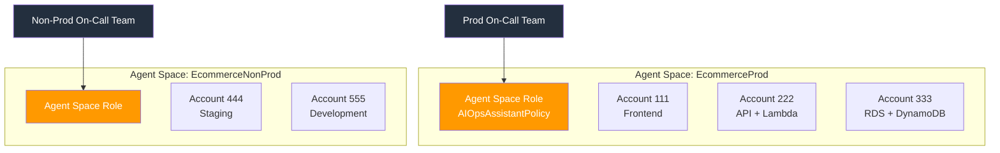
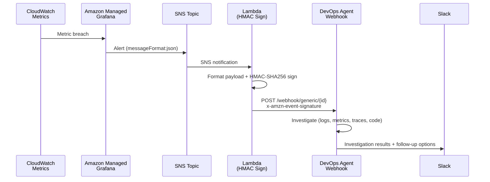
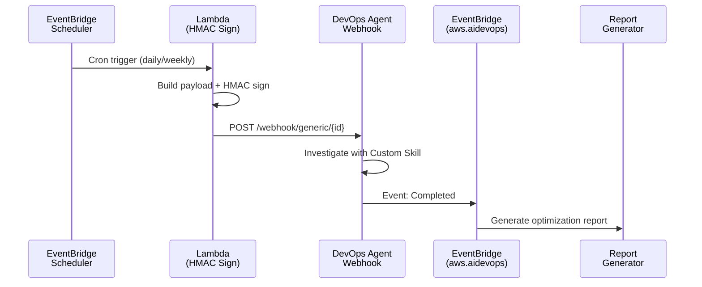
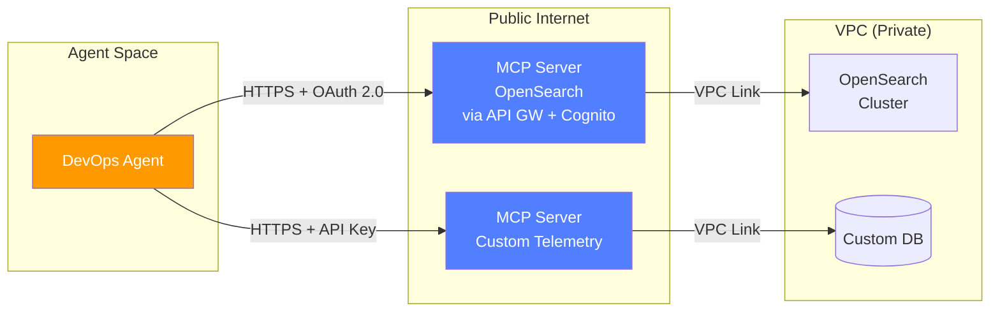
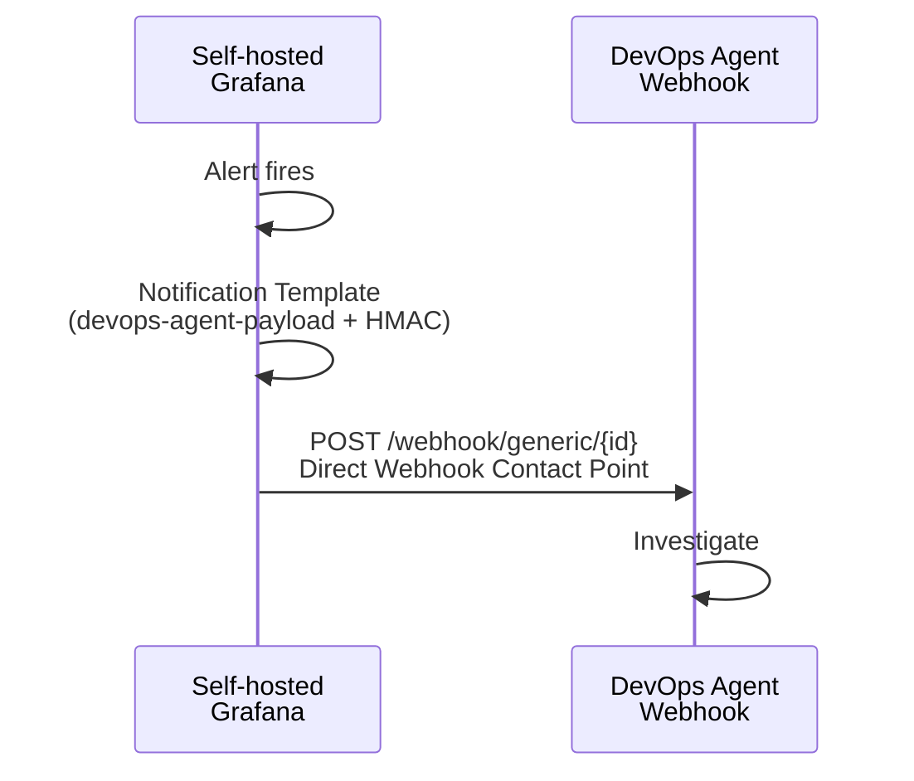
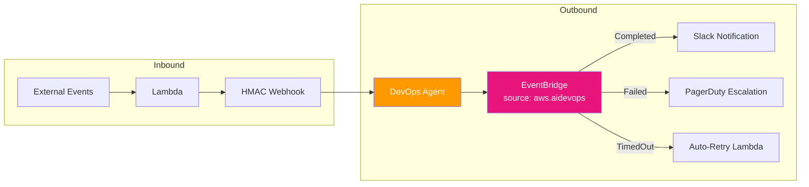
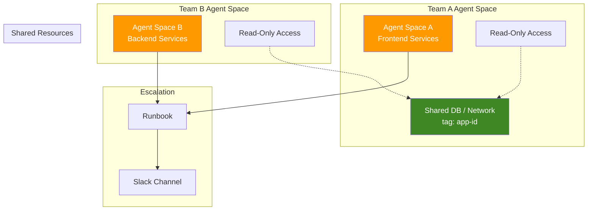

# Architecture Diagrams

These diagrams use [Mermaid](https://mermaid.js.org/) syntax and render natively on GitHub.

## 1. Agent Space Design — On-Call Boundary Pattern

## 2. Reactive Pattern — AMG Alert → DevOps Agent

## 3. Proactive Pattern — Scheduled Investigation

## 4. MCP Server Integration Pattern

## 5. Self-hosted Grafana — Direct Webhook (Zero Lambda)

## 6. EventBridge Bidirectional Integration

## 7. Cross-Team Investigation Pattern

